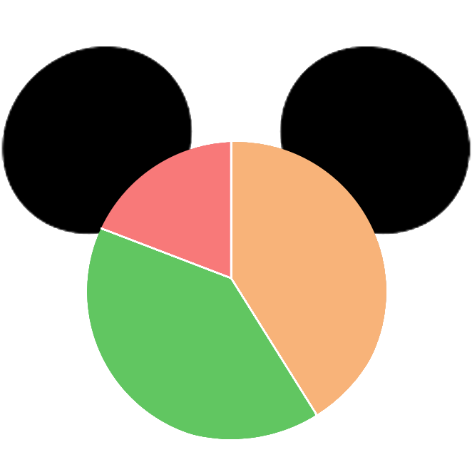

<p align="center">
  <a href="https://www.dvcstats.com">
    
  </a>

  <h1 align="center">Disney Vacation Club Right-of-First-Refusal Stats</h3>

  <p align="center">
    A simple application to visualize trends of DVC ROFR data provided by members of <a href="https://www.disboards.com/forums/purchasing-dvc.28/">disboards.com</a>.
    <br />
    <br />
    Can be found hosted at <a href="https://www.dvcstats.com"><strong>https://www.dvcstats.com</strong></a>
    <br />
    <br />
    <a href="https://github.com/davidkassa/dvc-rofr-stats/issues">Report Bug</a>
    ·
    <a href="https://github.com/davidkassa/dvc-rofr-stats/issues">Request Feature</a>
  </p>
</p>

---

## Development

<!-- PROJECT SHIELDS -->
<!--
*** I'm using markdown "reference style" links for readability.
*** Reference links are enclosed in brackets [ ] instead of parentheses ( ).
*** See the bottom of this document for the declaration of the reference variables
*** for contributors-url, forks-url, etc. This is an optional, concise syntax you may use.
*** https://www.markdownguide.org/basic-syntax/#reference-style-links
-->

[![Contributors][contributors-shield]][contributors-url]
[![Forks][forks-shield]][forks-url]
[![Stargazers][stars-shield]][stars-url]
[![Issues][issues-shield]][issues-url]
[![MIT License][license-shield]](LICENSE)

| Service       | [Main](https://www.dvcstats.com)             | [Develop](https://dev.dvcstats.com)                   |
| ------------- | -------------------------------------------- | ----------------------------------------------------- |
| CI Status     | [![Main][build-main-shield]][build-main-url] | [![Develop][build-develop-shield]][build-develop-url] |
| Build History | [![Main][build-main-history]]                | [![Develop][build-develop-history]]                   |
Note: Build history is not working

### Getting started

This should be all you need to do to get started. This will point to an existing Firebase database that is read-only.

```javascript
npm install -g @vue/cli
git clone git@github.com:davidkassa/dvc-rofr-stats.git && cd dvc-rofr-stats
npm install
npm run serve
```

### Firebase

To get Firebase Functions or your own Firestore Database running you can follow their [Get Started](https://firebase.google.com/docs/functions/get-started) documentation.

- Run `npm install -g firebase-tools`
- Create a [Firebase project](https://console.firebase.google.com)
- [Create an Admin key](https://firebase.google.com/docs/functions/local-emulator#set_up_admin_credentials_optional) and name it service-key-dev.json.local
- Update [.firebaserc](.firebaserc)
- Call `npm run test:firebase` or `cd functions && npm run shell`
- If all works, you can deploy from the [/functions](/functions) directory with `npm run deploy`

You may need to authenticate with the Firebase CLI as well. I was already authenticated.

<!-- ROADMAP -->

## Roadmap

See the [open issues](https://github.com/davidkassa/dvc-rofr-stats/issues) for a list of proposed features (and known issues).

<!-- CONTRIBUTING -->

## Contributing

Contributions are what make the open source community such an amazing place to be learn, inspire, and create. Any contributions you make are **greatly appreciated**.

1. Fork the Project
2. Create your Feature Branch (`git checkout -b feature/AmazingFeature`)
3. Commit your Changes (`git commit -m 'Add some AmazingFeature'`)
4. Push to the Branch (`git push origin feature/AmazingFeature`)
5. Open a Pull Request on the `develop` branch

<!-- LICENSE -->

## License

Distributed under the MIT License. See [LICENSE](LICENSE) for more information.

<!-- MARKDOWN LINKS & IMAGES -->
<!-- https://www.markdownguide.org/basic-syntax/#reference-style-links -->

[contributors-shield]: https://img.shields.io/github/contributors/davidkassa/dvc-rofr-stats?style=flat-square
[contributors-url]: https://github.com/davidkassa/dvc-rofr-stats/graphs/contributors
[forks-shield]: https://img.shields.io/github/forks/davidkassa/dvc-rofr-stats?style=flat-square
[forks-url]: https://github.com/davidkassa/dvc-rofr-stats/network/members
[stars-shield]: https://img.shields.io/github/stars/davidkassa/dvc-rofr-stats?style=flat-square
[stars-url]: https://github.com/davidkassa/dvc-rofr-stats/stargazers
[issues-shield]: https://img.shields.io/github/issues/davidkassa/dvc-rofr-stats?style=flat-square
[issues-url]: https://github.com/davidkassa/dvc-rofr-stats/issues
[license-shield]: https://img.shields.io/github/license/davidkassa/dvc-rofr-stats?style=flat-square
[build-main-shield]: https://img.shields.io/travis/com/davidkassa/dvc-rofr-stats/main?style=flat-square
[build-main-url]: https://travis-ci.com/davidkassa/dvc-rofr-stats
[build-main-history]: https://buildstats.info/travisci/chart/davidkassa/dvc-rofr-stats?includeBuildsFromPullRequest=false&branch=main
[build-develop-shield]: https://img.shields.io/travis/com/davidkassa/dvc-rofr-stats/develop?style=flat-square
[build-develop-url]: https://travis-ci.com/davidkassa/dvc-rofr-stats/branches
[build-develop-history]: https://buildstats.info/travisci/chart/davidkassa/dvc-rofr-stats?includeBuildsFromPullRequest=false&branch=develop
